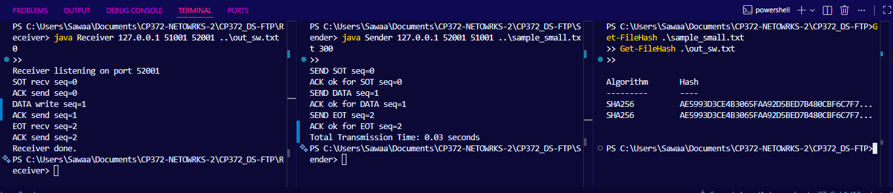
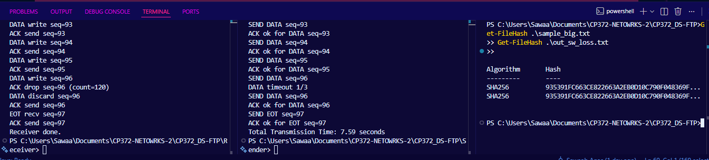
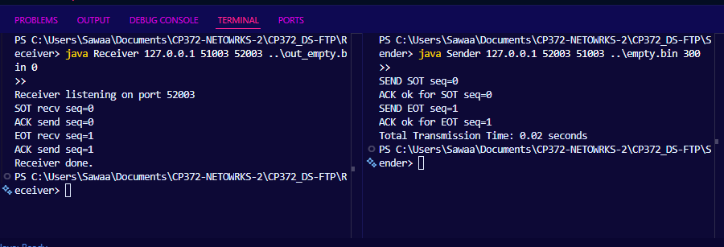
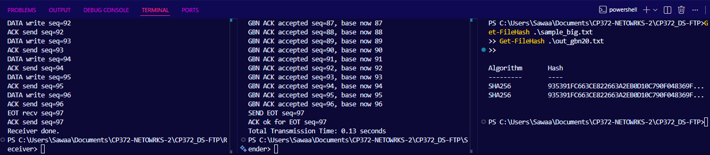
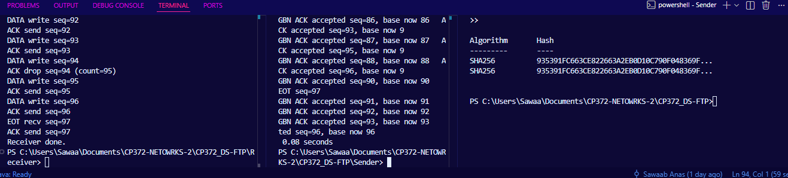
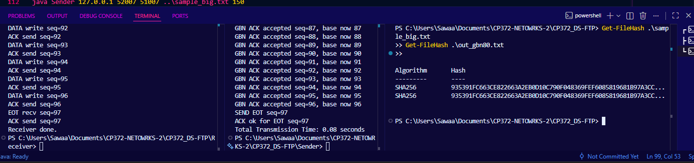
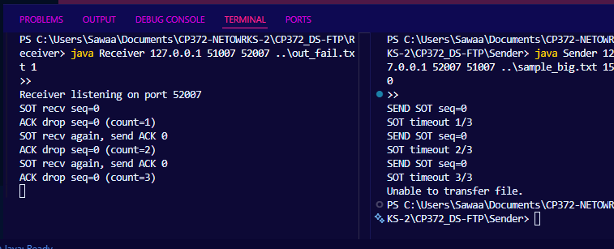
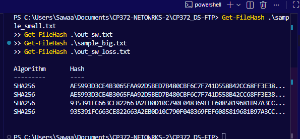

# DS-FTP Testing Guide
---------------------------------------------------------------------------------------------
This file has:
- manual testing with 2 terminals

---------------------------------------------------------------------------------------------
##  Manual Testing (2 terminals)
### start powerfshell  

```powershell
cd Receiver
javac *.java
```

```powershell
cd Sender
javac *.java
```

### input Files Present  
`sample_small.txt`
`sample_big.txt`
`empty.bin`


### Run tests
#### M1) stop and wait basic RN=0

java Receiver 127.0.0.1 51001 52001 ..\out_sw.txt 0

java Sender 127.0.0.1 52001 51001 ..\sample_small.txt 300


normal handshake + data + teardown with no ACK drop


#### M2) stop and wait with ACK loss RN=5

java Receiver 127.0.0.1 51002 52002 ..\out_sw_loss.txt 5

java Sender 127.0.0.1 52002 51002 ..\sample_big.txt 300


every 5th ACK is dropped, sender should timeout and resend

#### M3) Empty file

java Receiver 127.0.0.1 51003 52003 ..\out_empty.bin 0

java Sender 127.0.0.1 52003 51003 ..\empty.bin 300



no DATA packets only SOT and EOT flow.

#### M4) GBN window 20

[$]env:DSFTP_WINDOW="20"
java Receiver 127.0.0.1 51004 52004 ..\out_gbn20.txt 0

java Sender 127.0.0.1 52004 51004 ..\sample_big.txt 300 20


checks GBN + chaos 4-packet send order

#### M5) GBN window 40 + ACK loss

[$]env:DSFTP_WINDOW="40"
java Receiver 127.0.0.1 51005 52005 ..\out_gbn40_loss.txt 5

java Sender 127.0.0.1 52005 51005 ..\sample_big.txt 300 40


checks GBN buffering/cumulative ACK with dropped ACKs

#### M6) GBN window 80 + wrap stress

[$]env:DSFTP_WINDOW="80"
java Receiver 127.0.0.1 51006 52006 ..\out_gbn80.txt 100

java Sender 127.0.0.1 52006 51006 ..\sample_big.txt 300 80


cchecks bigger window behavvior and longer transfers

#### M7) Critical timeout failure

java Receiver 127.0.0.1 51007 52007 ..\out_fail.txt 1

java Sender 127.0.0.1 52007 51007 ..\sample_big.txt 150


-sender prints Unable to transfer file

Hash checks
Get-FileHash .\sample_small.txt
Get-FileHash .\out_sw.txt
Get-FileHash .\sample_big.txt
Get-FileHash .\out_sw_loss.txt


---------------------------------------------------------------------------------------------